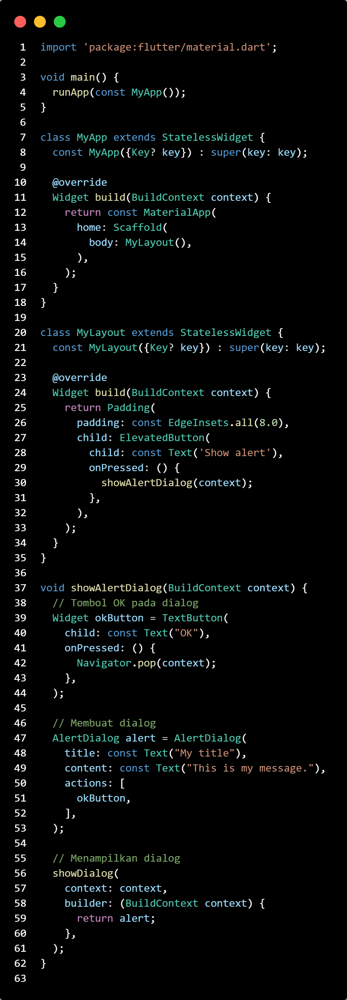

# hello_world

Nama : Sandra Devia Arge 
NIM : 2241720222
Kelas : TI - 3F

---

A new Flutter project.

## **Praktikum 1**

## **Praktikum 2**

## **Praktikum 3**

**Langkah 12**
,

*Output*

## **Praktikum 4**

**Langkah 1: Text Widget**
Buat folder baru basic_widgets di dalam folder lib. Kemudian buat file baru di dalam basic_widgets dengan nama text_widget.dart. Ketik atau salin kode program berikut ke project hello_world Anda pada file text_widget.dart.

Lakukan import file text_widget.dart ke main.dart, lalu ganti bagian text widget dengan kode di atas. Maka hasilnya seperti gambar berikut. Screenshot hasil milik Anda, lalu dibuat laporan pada file README.md.

*Output*

**Langkah 2: Image Widget**

Buat sebuah file image_widget.dart di dalam folder basic_widgets dengan isi kode berikut.

*Output*

## **Praktikum 5**
**Langkah 1: Cupertino Button dan Loading Bar**
Buat file di basic_widgets > loading_cupertino.dart. Import stateless widget dari material dan cupertino. Lalu isi kode di dalam method Widget build adalah sebagai berikut.

*Output*

**Langkah 2: Floating Action Button (FAB)**
Button widget terdapat beberapa macam pada flutter yaitu ButtonBar, DropdownButton, TextButton, FloatingActionButton, IconButton, OutlineButton, PopupMenuButton, dan ElevatedButton.

Buat file di basic_widgets > fab_widget.dart. Import stateless widget dari material. Lalu isi kode di dalam method Widget build adalah sebagai berikut.

*Output*

Langkah 3: Scaffold Widget
Scaffold widget digunakan untuk mengatur tata letak sesuai dengan material design.

Ubah isi kode main.dart seperti berikut.

*Ouput*

**Langkah 4: Dialog Widget**
Dialog widget pada flutter memiliki dua jenis dialog yaitu AlertDialog dan SimpleDialog.

Ubah isi kode main.dart seperti berikut.

*Output*

**Langkah 5: Input dan Selection Widget**
Flutter menyediakan widget yang dapat menerima input dari pengguna aplikasi yaitu antara lain Checkbox, Date and Time Pickers, Radio Button, Slider, Switch, TextField.

Contoh penggunaan TextField widget adalah sebagai berikut:

*Output*

**Langkah 6: Date and Time Pickers**
Date and Time Pickers termasuk pada kategori input dan selection widget, berikut adalah contoh penggunaan Date and Time Pickers.

*Output*

