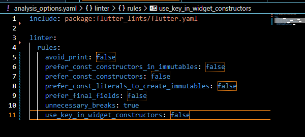
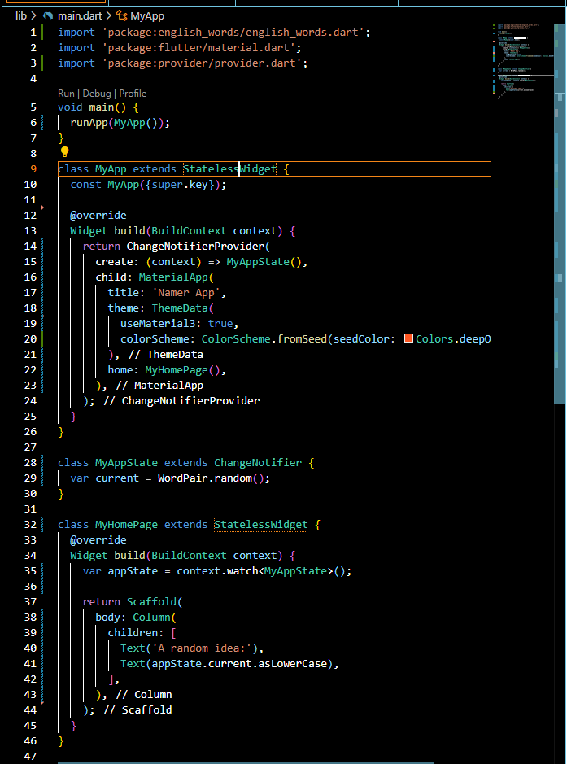
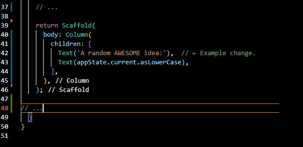

# Pemrograman Mobile - Pertemuan 5

<table>
    <thead>
        <th style="text-align: center;" colspan="2">Pertemuan 5</th>
    </thead>
    <tbody>
        <tr>
            <td>Nama</td>
            <td>Sandra Devia Arge</td>
        </tr>
        <tr>
            <td>Nim</td>
            <td>2241720222</td>
        </tr>
    </tbody>
</table>

# Codelabs: Your first Flutter app

**Langkah 1: Create a project**

Membuat project baru dengan nama `namer_app`.

Menambahkan library pada file `pubspec.yaml`.

Menambahkan linter pada file `analysis_options.yaml`.

Merubah isi kode pada file `main.dart`.

**Langkah 2: Add a button**

Menjalanakan aplikasi pada device.

Mengubah Widget Text, menyimpan dan otomatis melakukan hot reload.

Selanjutnya, tambahkan tombol di bagian bawah Kolom, tepat di bawah contoh Teks kedua.

Ketika tombol ditekan, maka akan muncul di Debug Console.

Menambahkan fungsi `getNext()` pada file `main.dart`, Lalu menambahkan fungsi tersebut pada Button.

Ketika tombol ditekan, maka text akan berubah.

**Langkah 3: Make the app prettier**

Melakukan sedikit perubahan kode pada file `main.dart`.

Melakukan Extract Widget pada Text Widget.

Wrap Widget Text di `BigCard` dengan Widget Padding.

Wrap Widget Padding dengan Widget Card.

Merubah warna background pada Card.

Menambahkan style ke Text Widget.

Menambahkan semanctic label pada Text untuk Screen Reader seperti Talkback.

Membuat isi di Column menjadi ke tengah secara vertikal.

Wrap Column dengan Widget Center.

Hapus Widget Text yang tidak digunakan, dan menambahkan Widget SizedBox untuk meberikan gap antara BigCard dengan Button.

**Langkah 4: Add functionality**

Menambahkan bussiness logic pada aplikasi.

Menambahkan button Like dengan icon.

Ketika tombol Like ditekan, maka akan berubah.

**Langkah 5: Add navigation rail**

Replace semua kode pada file `main.dart`.

Merubah MyHomePage menjadi StatefulWidget.

Menambahkan property `selectedIndex`.

Jika tombol navigasi ditekan, maka akan berubah.

Membuat properti untuk navigasi ke halaman lain.

Jika navigasi ditekan, maka akan berpindah ke halaman lain.

Membuat halaman menjadi responsive dengan LayoutBuilder.

Sekarang jika layar diubah ukurannya atau melakukan rotate, maka akan berubah.

**Langkah 6: Add a new page**

Membuat page baru dengan nama `FavoritePage`, untuk menampilkan list favorite.

Jika melakukan like pada halaman utama, maka akan muncul di halaman Favorite sebagai list.

